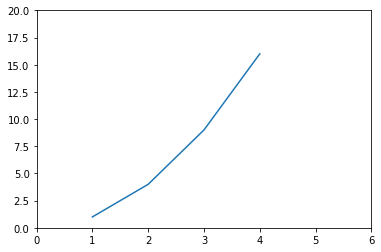
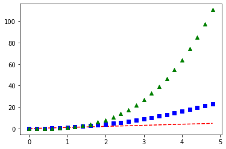
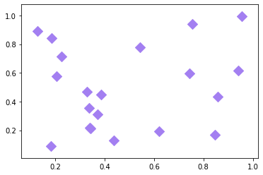
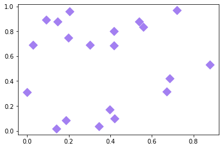
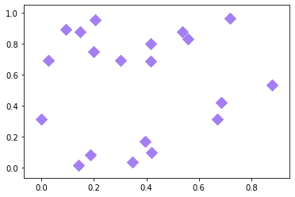
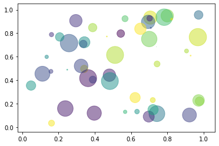
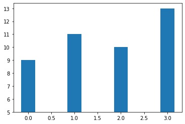
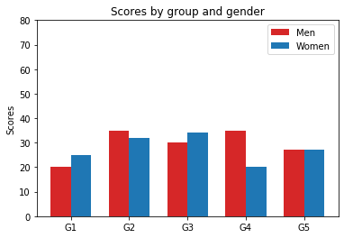

<div class="input_area" markdown="1">

```python
import matplotlib.pyplot as plt
import numpy as np

```

</div>


<div class="input_area" markdown="1">

```python


plt.plot([1,2,3,4])
```

</div>


{:.output_data_text}
```
[<matplotlib.lines.Line2D at 0xa7b8f70>]
```


<div class="input_area" markdown="1">

```python
plt.plot([1,2,3,4], [1,4,9,16])
plt.axis([0,6,0,20])
```

</div>


{:.output_data_text}
```
[0, 6, 0, 20]
```





<div class="input_area" markdown="1">

```python
t = np.arange(0, 5., 0.2)

plt.plot(t, t, 'r--', t, t**2, 'bs', t, t**3, 'g^')
```

</div>


{:.output_data_text}
```
[<matplotlib.lines.Line2D at 0x586b930>,
 <matplotlib.lines.Line2D at 0x586ba30>,
 <matplotlib.lines.Line2D at 0x586baf0>]
```





<div class="input_area" markdown="1">

```python
n = 20
x = np.random.rand(n)
y = np.random.rand(n)

plt.scatter(x, y, s=100, c='#a37ff1', marker='D')
```

</div>


{:.output_data_text}
```
<matplotlib.collections.PathCollection at 0xac83170>
```





<div class="input_area" markdown="1">

```python
np.random.seed(1)
n = 20
x = np.random.rand(n)
y = np.random.rand(n)

plt.plot(x, y, 'D', c='#a37ff1', markersize=10)
```

</div>


{:.output_data_text}
```
[<matplotlib.lines.Line2D at 0x5b69e50>]
```





<div class="input_area" markdown="1">

```python
np.random.seed(1)
n = 20
x = np.random.rand(n)
y = np.random.rand(n)

plt.scatter(x, y, s=100, c='#a37ff1', marker='D')
```

</div>


{:.output_data_text}
```
<matplotlib.collections.PathCollection at 0x5a4dd50>
```





<div class="input_area" markdown="1">

```python
np.random.seed(19680801)

n = 50
x = np.random.rand(n)
y = np.random.rand(n)
colors = np.random.rand(n)
area = (30 * np.random.rand(n))**2

plt.scatter(x, y, s=area, c=colors, alpha=0.5)
```

</div>


{:.output_data_text}
```
<matplotlib.collections.PathCollection at 0x58c2a90>
```





<div class="input_area" markdown="1">

```python
ind = np.arange(4)

y = [4,6,5,8]
plt.bar(ind, y, width=0.3, bottom=5)
```

</div>


{:.output_data_text}
```
<BarContainer object of 4 artists>
```





<div class="input_area" markdown="1">

```python
n = 5
menMeans = (20, 35, 30, 35, 27)
womenMeans = (25, 32, 34, 20, 27)

ind = np.arange(n)
width = 0.35

p1 = plt.bar(ind-width/2, menMeans, width, color='#d62728')
p2 = plt.bar(ind+width/2, womenMeans, width)

plt.ylabel('Scores')
plt.title('Scores by group and gender')
plt.xticks(ind, ('G1', 'G2', 'G3', 'G4', 'G5'))
plt.yticks(np.arange(0, 81, 10))
plt.legend((p1, p2), ('Men', 'Women'))
```

</div>


{:.output_data_text}
```
<matplotlib.legend.Legend at 0xd71c3b0>
```





<div class="input_area" markdown="1">

```python
lables = 'Frogs', 'Hogs', 'Dogs', 'Logs'
sizes = 15, 30, 45, 10
explode = 0, 0.1, 0, 0

%matplotlib inline
plt.pie(sizes, explode=explode, labels=lables, autopct='%1.1f%%',
       shadow=True, startangle=90)
plt.axis('equal')
plt.legend()
```

</div>


{:.output_traceback_line}
```
---------------------------------------------------------------------------
```

{:.output_traceback_line}
```
NameError                                 Traceback (most recent call last)
```

{:.output_traceback_line}
```
<ipython-input-1-ecc449048141> in <module>
      3 explode = 0, 0.1, 0, 0
      4 
----> 5 plt.figure(figsize=(12, 3))
      6 plt.pie(sizes, explode=explode, labels=lables, autopct='%1.1f%%',
      7        shadow=True, startangle=90)

```

{:.output_traceback_line}
```
NameError: name 'plt' is not defined
```


<div class="input_area" markdown="1">

```python
v = np.random.uniform(0., 10., 4)
plt.uniform(v)
```

</div>


{:.output_traceback_line}
```
---------------------------------------------------------------------------
```

{:.output_traceback_line}
```
AttributeError                            Traceback (most recent call last)
```

{:.output_traceback_line}
```
<ipython-input-18-7aed01b667b0> in <module>
      1 v = np.random.uniform(0., 10., 4)
----> 2 plt.uniform(v)

```

{:.output_traceback_line}
```
AttributeError: module 'matplotlib.pyplot' has no attribute 'uniform'
```


<div class="input_area" markdown="1">

```python
plt.subplot()
```

</div>
